### SVM group exercise
---
**Introduction to Machine Learning**

**Request:**
Description churn_rate_prediction.csv
- Apply all knowledge and techniques that you have learned for this
- You must organize your notebook based on the Homework
- Should not drop NA and missing value
Deadline:
- 3 weeks - (2023-06-25)

**Content**
1. Read and understand churn_rate_prediction.csv data
     Customer demographic data:
     - customer_id: Unique identifier for each customer
     - Name: Name
     - age: Age
     - gender: Gender
     - security_no: Insurance number
     - region_category: Region classification
     - membership_category: Membership classification
     - joining_date: Joining date

     Customer access process:
     - joined_through_referral: Customers join through referrals
     - referral_id: ID of the referred customer
     The customer's preference:
     - preferred_offer_types: Offer types
     - medium_of_operation: Means of operation
     - internet_option: Internet options

     Customer behavior:

     - last_visit_time: Last visit time
     - days_since_last_login: Number of days since last login
     - avg_time_spent: Average time
     - avg_transaction_value: Average transaction value
     - avg_frequency_login_days: Average login frequency per day
     - points_in_wallet: Number of points in wallet
     - used_special_discount: Whether the customer has used the special discount or not

     Customer's feedback:
     - feedback: Customer feedback

     Risk of customer churn:
     - churn_risk_score: Risk score

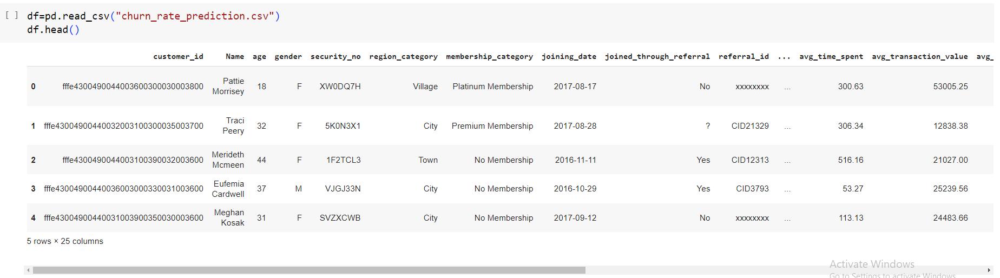

2. Data Exploration
   
     a. Export information and visualize data using ProfileReport
     b. Data Preprocessing
       - Handle missing values and select necessary features

     c. EDA visualization of metrics, python statistics of data and analysis with Power Bi
         - Heatmap before data processing
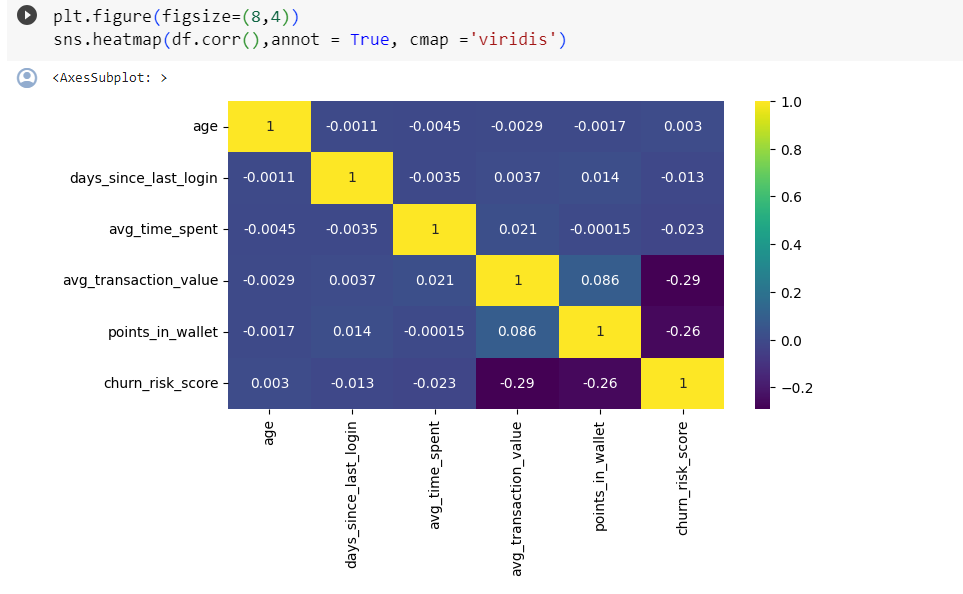

         - Heatmap after data processing
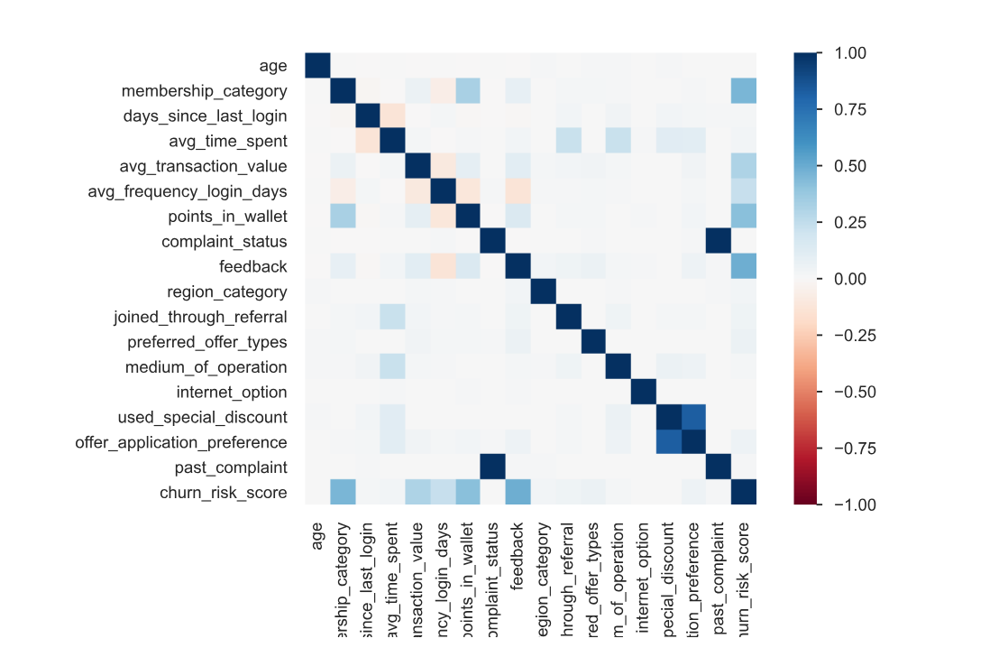

         - Statistical graphs
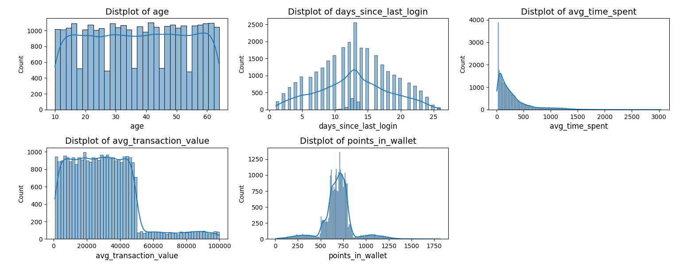

         - Number of classes in target
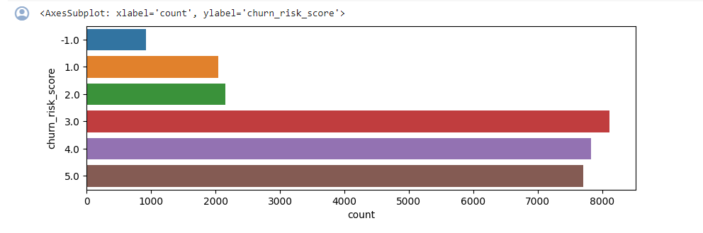

         - Handle outliers in the data
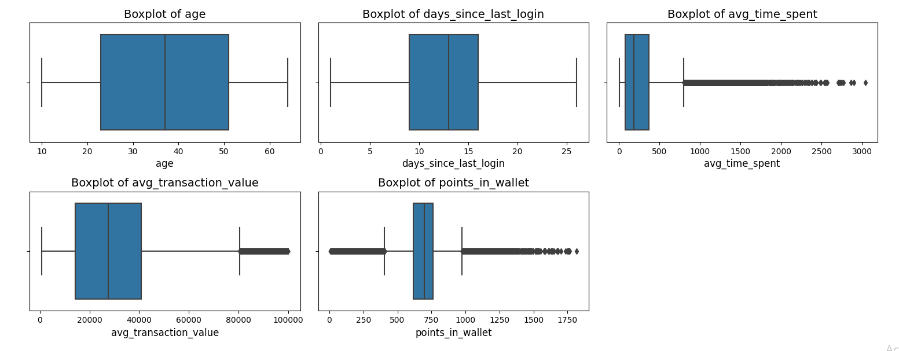

     d. Intuitive with Power Bi
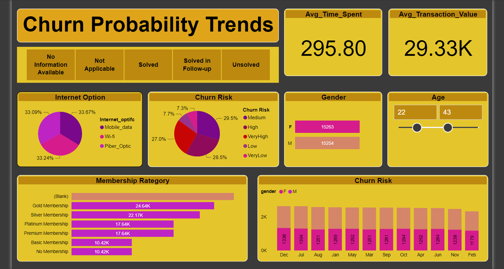

3. Build the model
- Build models including logistic regression, decision trees, Random Forest, CatBoost, XGBoost, MLP, SVM
     a. For training set
           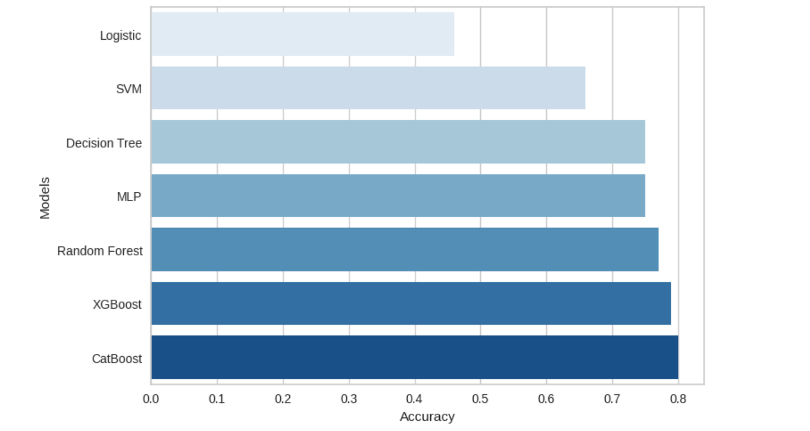
     b. For test set
           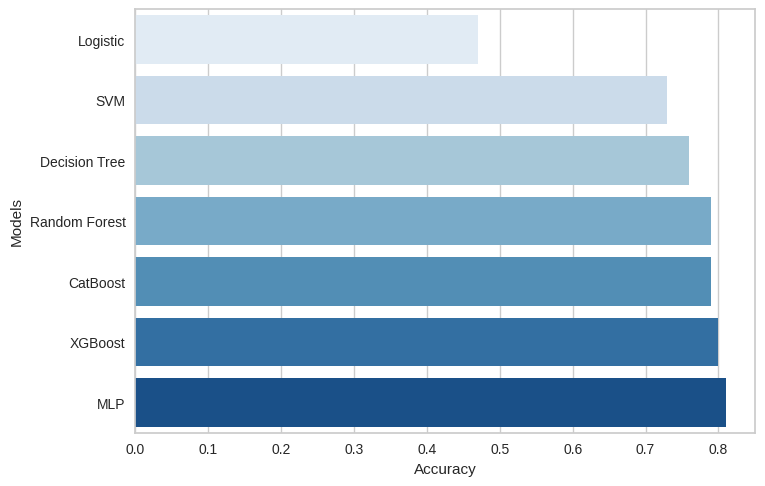
- Found that the prediction values in both train and test sets are quite similar
     a. For the training set of SVM
           
  
     b. For the test set of SVM
           
  
     c. For Catboost Models
           
  
- Among techniques such as Smote, RandomUndersampling, resample,... handling imbalance data. Found Smote for the best performance. Through recall, although the problem has been improved, there is still a difference of about 10% compared to other classes.
- Catboost model gives the best accuracy results of 80% on both train and test sets. The recall value is also better than other models.
- Experiment with GridSearchCV and PCA for SVM Model

     a. PCA with dimensionality of 4
  
     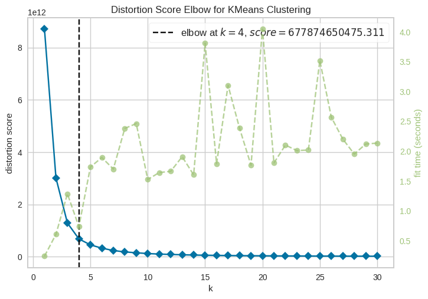
  
     b. GridSearchCV SVM Model
  
     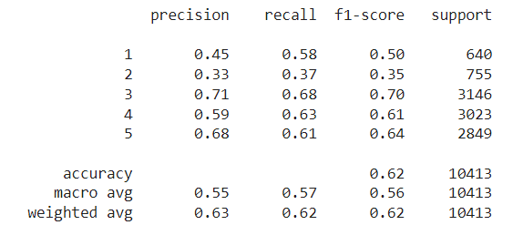
  
     c. Noticed GridSearchCV doesn't improve. Could this be because the search grid array is not optimal?
  
4. Evaluate the model
   
- The data processing process has limited information loss as much as possible. Even though it's not the most effective yet. However, there are still some issues that need to be resolved such as needing to reprocess the data to be more optimal, low performance on some layers, imbalance handling on layers that need to be considered through ratios.
  
- Have not tested, evaluated and compared techniques such as PCA, Polynomial transform, Grid SearchCV... for other models to compare and select appropriate parameters.
