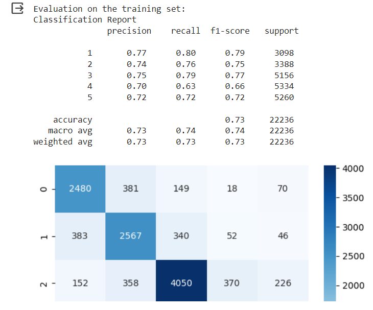
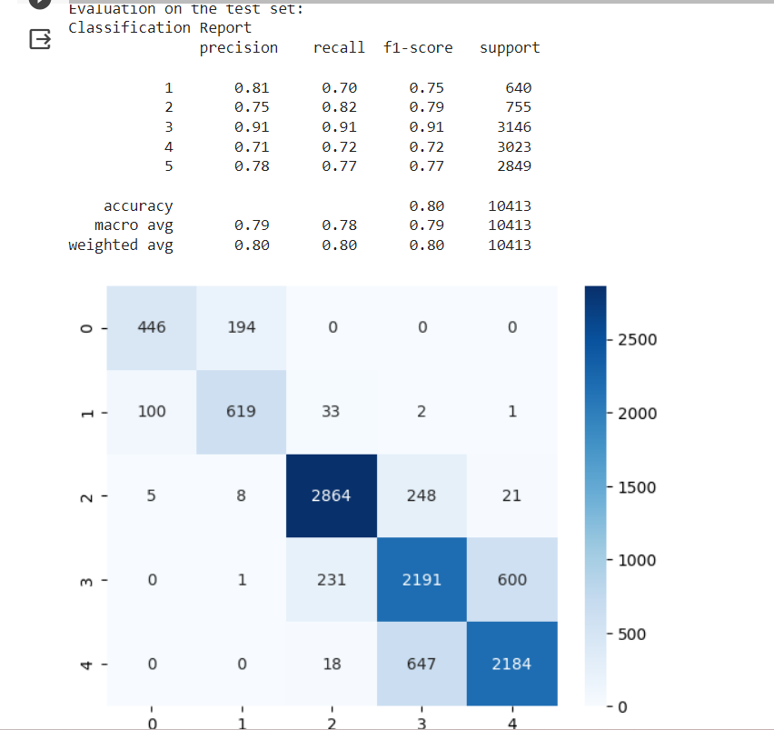

### Bài tập nhóm SVM
---
**Môn Nhập môn máy học (Machine Learning)**

**Yêu cầu:**
Description churn_rate_prediction.csv
- Apply all knowledge and techniques that you have learned for this
- You must organize your notebook based on the Homework
- Should not drop NA and missing value
Deadline:
- 3 weeks - (2023-06-25)

**Nội dung**
1. Đọc hiểu dữ liệu churn_rate_prediction.csv
    Dữ liệu nhân khẩu học của khách hàng:
    - customer_id: Mã định danh duy nhất cho mỗi khách hàng
    - Name: Tên 
    - age: Tuổi 
    - gender: Giới tính 
    - security_no: Số bảo hiểm 
    - region_category: Phân loại khu vực 
    - membership_category: Phân loại thành viên 
    - joining_date: Ngày tham gia

    Quá trình tiếp cận khách hàng:
    - joined_through_referral: Khách hàng tham gia thông qua giới thiệu
    - referral_id: ID của khách hàng đã giới thiệu 
    Sở thích của khách hàng:
    - preferred_offer_types: Loại ưu đãi
    - medium_of_operation: Phương tiện hoạt động 
    - internet_option: Tùy chọn internet 

    Hành vi của khách hàng:

    - last_visit_time: Thời gian truy cập cuối cùng 
    - days_since_last_login: Số ngày kể từ lần đăng nhập cuối 
    - avg_time_spent: Thời gian trung bình 
    - avg_transaction_value: Giá trị giao dịch trung bình
    - avg_frequency_login_days: Tần suất đăng nhập trung bình mỗi ngày
    - points_in_wallet: Số điểm trong ví 
    - used_special_discount: Khách hàng đã sử dụng giảm giá đặc biệt hay chưa

    Phản hồi của khách hàng:
    - feedback: Phản hồi của khách hàng

    Rủi ro rời đi của khách hàng:
    - churn_risk_score: Điểm rủi ro 

2. Khám phá Dữ liệu (Data Exploration)
   
    a. Xuất các thông tin và trực quan các dữ liệu bằng ProfileReport
    b. Tiền xử lý Dữ liệu (Data Preprocessing)
      - Xử lý missing value và chọn các features cần thiết

    c. Trực quan EDA các số liệu, thống kê bằng python của dữ liệu và phân tích với Power Bi
    d. Xử lý outliers và imbalance có trong dữ liệu

3. Xây dựng mô hình
- Xây dựng các mô hình gồm logistic regression, decision trees, Random Forest, CatBoost, XGBoost, MLP, SVM, and implementing gridsearchCV with SVM.

    Đối với tập test:
    

      
4. Đánh giá mô hình
- Trong số các kỹ thuật như Smote, RandomUndersampling,resample,... xử lý imbalance data. Nhận thấy Smote cho hiệu suất tốt nhất. Thông qua recall, tuy đã cải thiện vấn đề nhưng vẫn tồn tại chênh lệch khoảng 10% so với các lớp khác. 
- Mô hình Catboost cho kết quả accuracy tốt nhất là 80% trên cả tập train và test. Giá trị recall cũng tốt hơn các mô hình khác.
  
    
